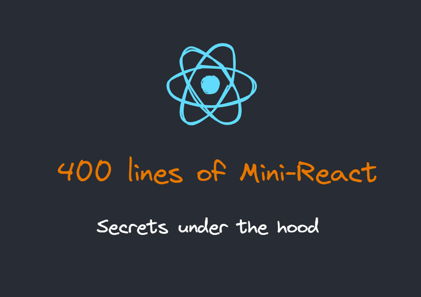

# Mini-React

**Implement Mini-React in 400 lines of code, a minimal model with asynchronous interruptible updates.**

# 代码参考
1. https://github.com/ZacharyL2/mini-react
2. https://pomb.us/build-your-own-react/

# Demo
使用 React 官网的 [tic-tac-toe tutorial example](https://react.dev/learn/tutorial-tic-tac-toe#what-are-we-building) 作为 demo.
